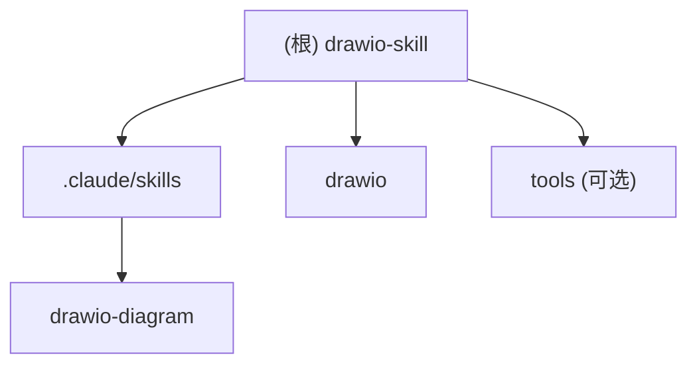

# Draw.io Diagram Skill

## 项目愿景

一个独立的 Claude Code Skill，用于从自然语言描述生成专业的 draw.io 图表文件（`.drawio`），不依赖 MCP。支持流程图、架构图、时序图、ER图、思维导图等多种图表类型。

---

## 架构总览

```
drawio-skill/
├── .claude/
│   └── skills/
│       └── drawio-diagram/     # 核心 Skill 定义
│           └── skill.md        # Skill 规范文档
├── tools/                      # 可选增强工具 (Optional)
│   ├── src/                    # TypeScript 源码
│   │   ├── xml-validation.ts   # XML 验证与自动修复
│   │   ├── diagram-operations.ts # 图表 CRUD 操作
│   │   ├── history.ts          # 历史版本管理
│   │   └── index.ts            # 公共 API 入口
│   ├── dist/                   # 编译输出
│   └── README.md               # 工具使用文档
├── scripts/                    # CLI 脚本
│   ├── validate.ts             # 验证 .drawio 文件
│   └── repair.ts               # 自动修复 .drawio 文件
├── drawio/                     # 生成的图表默认输出目录
│   └── user-login-flow.drawio  # 示例图表
├── package.json                # npm 依赖配置
├── tsconfig.json               # TypeScript 配置
└── .gitignore
```

**技术栈：**
- Skill 定义格式: Markdown
- 输出格式: draw.io XML (mxGraphModel)
- 运行环境: Claude Code CLI
- 可选工具: TypeScript + linkedom + zod

---

## 模块结构图



---

## 模块索引

| 模块 | 路径 | 职责 |
|------|------|------|
| drawio-diagram | `.claude/skills/drawio-diagram/` | 核心 Skill，定义图表生成规则与模板 |
| tools | `tools/` | 可选增强工具：XML 验证、自动修复、CRUD 操作 |

---

## 运行与开发

### 使用方式

1. **触发 Skill：**
   - 使用 `/drawio-diagram` 命令
   - 或自然语言："create a diagram", "draw a flowchart", "generate architecture diagram"

2. **示例提示词：**
   ```
   Create a user login flow with input validation and error handling
   Draw an AWS architecture with CloudFront, ALB, EC2, and RDS
   Generate a sequence diagram showing API authentication flow
   ```

3. **查看输出：**
   - 默认输出到 `./drawio/` 目录
   - 文件可用 [diagrams.net](https://app.diagrams.net/) 或 draw.io 桌面版打开

### 输出路径规则

| 用户请求 | 输出路径 |
|----------|----------|
| 未指定路径 | `./drawio/<auto-name>.drawio` |
| 仅文件名 | `./drawio/<filename>.drawio` |
| 相对路径 | `<指定路径>/<auto-name>.drawio` |
| 绝对路径 | `<绝对路径>/<auto-name>.drawio` |

---

## 支持的图表类型

| 类型 | 描述 | 布局方向 |
|------|------|----------|
| 流程图 (Flowchart) | 业务流程、算法逻辑 | 自上而下 |
| 架构图 (Architecture) | 系统架构、云服务 | 自左向右 |
| 时序图 (Sequence) | API 调用、消息传递 | 列式布局 |
| ER 图 (Entity-Relationship) | 数据库模型 | 自由布局 |
| 思维导图 (Mind Map) | 概念整理、头脑风暴 | 径向布局 |

---

## 云服务图标支持

- **AWS (aws4)**: EC2, Lambda, S3, RDS, DynamoDB, API Gateway, CloudFront, ALB/ELB, VPC, Route 53, SNS, SQS, Cognito, CloudWatch
- **GCP (gcp2)**: Compute Engine, Cloud Functions, Cloud Storage, Cloud SQL, BigQuery, Pub/Sub, Cloud Run, GKE
- **Azure (azure2)**: Virtual Machine, App Service, Functions, SQL Database, Cosmos DB, Blob Storage, API Management, AKS
- **Kubernetes**: Pod, Service, Deployment, ConfigMap, Secret, Ingress, PersistentVolume, Namespace

---

## 编码规范

### XML 结构要求

1. **完整包装器**: 必须包含 `<mxfile>` 根元素
2. **保留 ID**: `id="0"` 和 `id="1"` 为根单元格，不可修改
3. **用户元素 ID 从 2 开始**
4. **所有 mxCell 必须是兄弟节点**，不可嵌套
5. **特殊字符转义**: `<` -> `&lt;`, `>` -> `&gt;`, `&` -> `&amp;`

### 布局约束

- 画布尺寸: 800 x 600 像素
- 安全区域: x: 40-760, y: 40-560
- 元素间距: 最小 150px
- 采用 4x3 网格系统定位

---

## AI 使用指引

### 生成前检查清单

- [ ] 确定图表类型（流程图/架构图/时序图/ER图/思维导图）
- [ ] 统计节点和关系数量
- [ ] 规划网格位置
- [ ] 识别潜在的边缘交叉点
- [ ] 确定是否需要云服务图标

### 生成后验证清单

- [ ] 完整的包装器结构
- [ ] 根单元格存在 (`id="0"` 和 `id="1"`)
- [ ] 所有 ID 唯一且从 "2" 开始
- [ ] 所有边有有效的 source/target
- [ ] 坐标在边界内
- [ ] 元素无重叠

---

## 可选增强工具 (Optional Tools)

项目提供了一套可选的验证和操作工具，用于确保生成的 `.drawio` 文件质量：

### 功能特性

**XML 验证 (xml-validation.ts)**
- 10+ 种验证规则（完整包装器、ID 唯一性、引用有效性等）
- 20+ 种自动修复能力（特殊字符转义、缺失元素补全、标签修复等）

**图表操作 (diagram-operations.ts)**
- CRUD 操作：添加、更新、删除单元格
- 级联删除：自动清理关联的边

**历史管理 (history.ts)**
- 保存最近 20 个版本
- 自动去重优化存储

### CLI 使用

```bash
# 安装依赖
npm install

# 构建工具
npm run build

# 验证图表文件
npm run validate -- ./drawio/my-diagram.drawio

# 自动修复图表文件
npm run repair -- ./drawio/my-diagram.drawio
```

### 编程式使用

```typescript
import { validateDrawioXML, repairDrawioXML } from './tools/dist/index.js';

const xml = await fs.readFile('./drawio/diagram.drawio', 'utf-8');

// 验证
const result = validateDrawioXML(xml);
if (!result.valid) {
  console.error('Validation error:', result.error);
}

// 修复
const repair = repairDrawioXML(xml);
if (repair.repaired && repair.repairedXML) {
  await fs.writeFile('./drawio/diagram.drawio', repair.repairedXML);
  console.log('Fixed issues:', repair.fixedIssues);
}
```

详细文档：[tools/README.md](./tools/README.md)

---

## 变更记录 (Changelog)

| 日期 | 版本 | 变更内容 |
|------|------|----------|
| 2026-01-22 | 1.1.0 | 新增可选增强工具：XML 验证、自动修复、CRUD 操作、历史管理 |
| 2026-01-21 | 1.0.0 | 初始化项目文档 |
